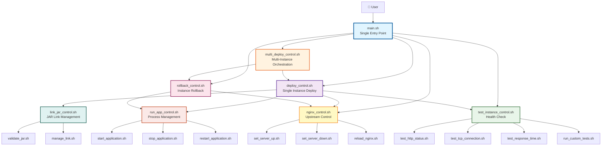
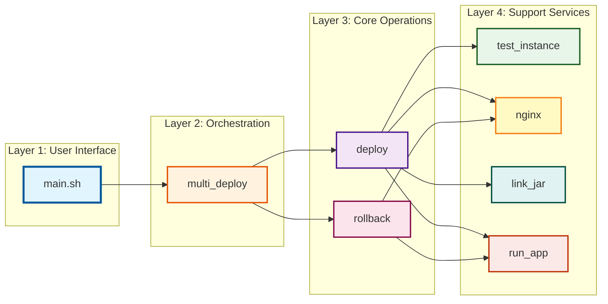
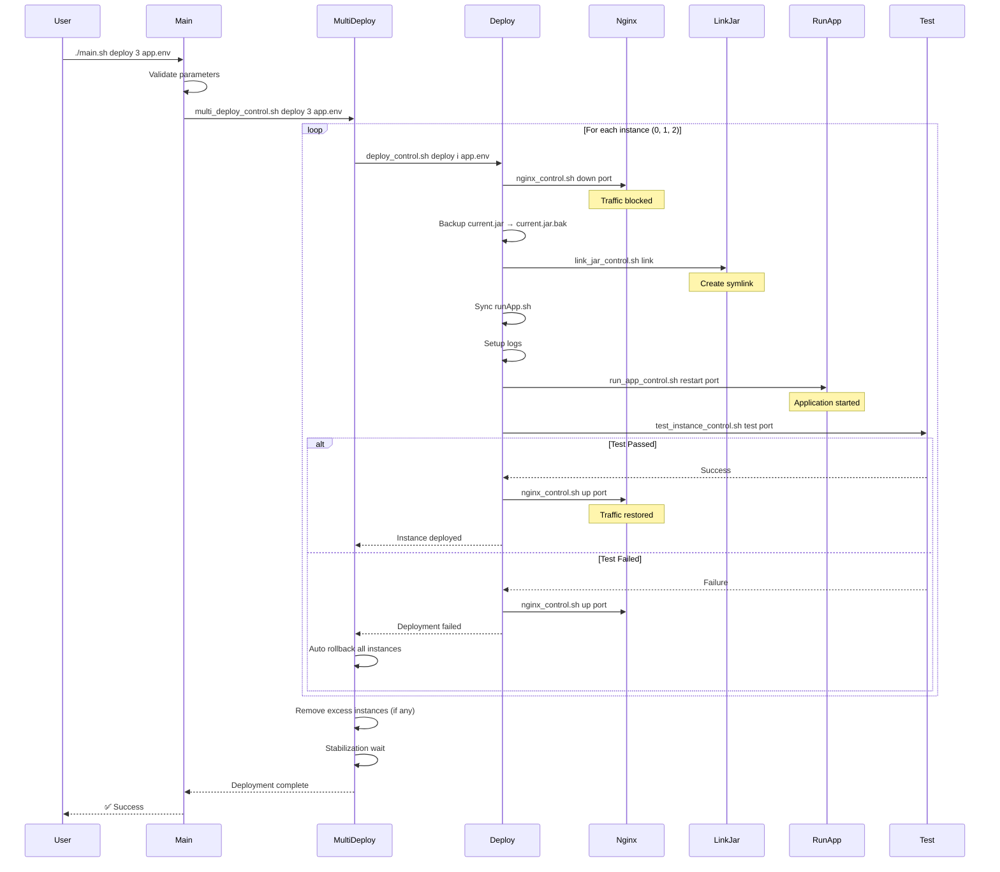
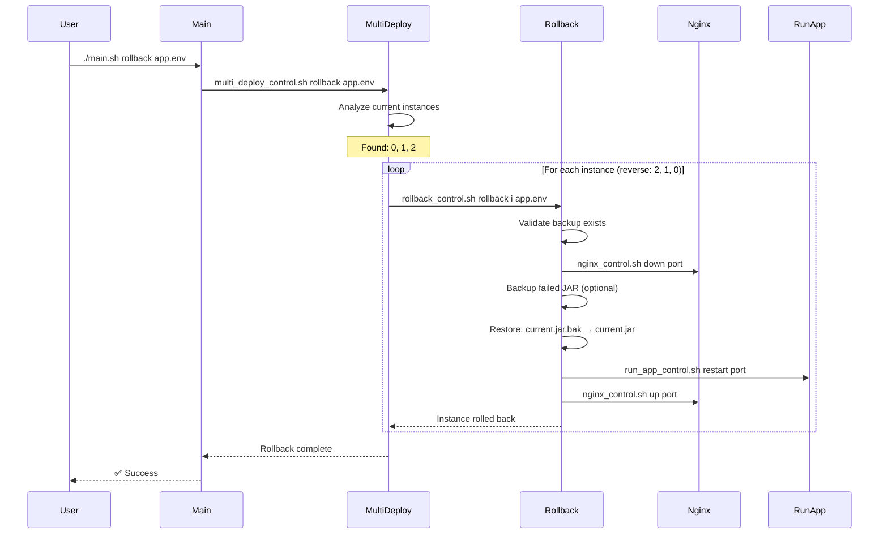
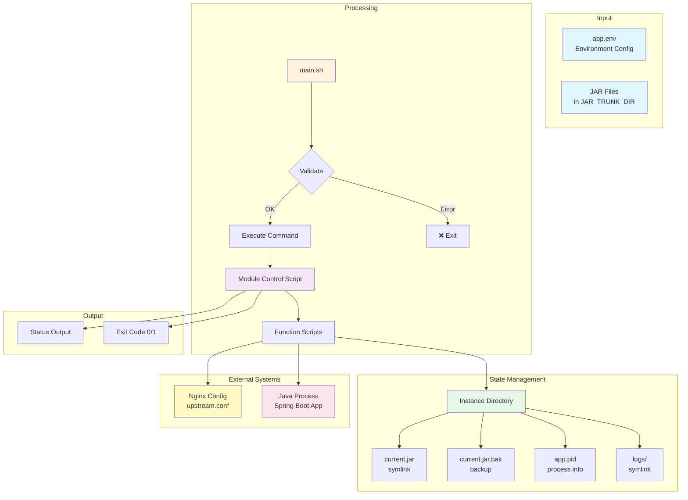

# Auto Deploy Shell - System Architecture

## System Overview

Auto Deploy Shell은 Spring Boot 애플리케이션의 다중 인스턴스 배포를 자동화하는 모듈형 시스템입니다. 단일 진입점(`main.sh`)을 통해 모든 배포 작업을 수행하며, 각 모듈은 독립적으로 동작하면서도 긴밀하게 통합되어 있습니다.

---

## Architecture Diagram



---

## System Hierarchy



---

## Deployment Flow



---

## Rollback Flow



---

## Module Data Flow



---

## Layer 1: User Interface

### main.sh - Single Entry Point

**책임**: 사용자 인터페이스 및 multi_deploy 모듈 호출

**주요 기능**:
- 명령어 파싱 및 검증
- 파라미터 검증 (인스턴스 개수, 환경 파일)
- multi_deploy 모듈 스크립트 존재 및 실행 권한 확인
- multi_deploy 모듈로 명령어 라우팅
- 컬러 출력 (성공/실패/경고/정보)
- 버전 정보 및 도움말 표시

**지원 명령어**:
| 명령어 | 대상 모듈 | 설명 |
|--------|----------|------|
| `deploy` | multi_deploy | 다중 인스턴스 배포 (2-10개) |
| `rollback` | multi_deploy | 전체 롤백 |
| `status` | multi_deploy | 배포 상태 |
| `validate` | multi_deploy | 배포 전 검증 |
| `version` | - | 버전 정보 |
| `help` | - | 도움말 |

**설계 원칙**:
- **단일 책임**: multi_deploy만 호출
- **계층 분리**: 하위 모듈(deploy, rollback)은 multi_deploy가 관리
- **단순성**: 사용자는 4개 명령어만 알면 됨

**특징**:
- 입력 검증 계층으로 잘못된 파라미터 사전 차단
- 모듈 스크립트 자동 권한 수정
- 일관된 에러 메시지 및 사용법 안내

**고급 사용법**:
- 단일 인스턴스 작업: `multi_deploy_control.sh` 직접 호출
- 모듈별 세부 제어: 각 모듈의 `*_control.sh` 직접 사용

---

## Layer 2: Orchestration

### multi_deploy - Multi-Instance Orchestration

**책임**: 여러 인스턴스의 배포/롤백 오케스트레이션

**주요 컴포넌트**:
```
multi_deploy/
├── multi_deploy_control.sh    # CLI 진입점
├── multi_deploy.env           # 기본 설정
└── func/
    ├── validate_parameters.sh  # 파라미터 검증
    ├── analyze_instances.sh    # 현재 상태 분석
    └── execute_deployment.sh   # 배포 실행
```

**핵심 기능**:

1. **파라미터 검증**:
   - 인스턴스 개수 범위 확인 (2-10)
   - 환경 변수 필수 항목 확인
   - 인스턴스 디렉터리 구조 검증

2. **인스턴스 분석**:
   - 현재 배포된 인스턴스 탐지
   - 타겟 개수와 비교
   - 스케일 업/다운 결정

3. **순차 배포**:
   - 각 인스턴스별로 deploy 모듈 호출
   - 대기 시간 적용 (`WAIT_BETWEEN_DEPLOYS`)
   - 실패 시 자동 롤백 (`AUTO_ROLLBACK`)

4. **스케일 조정**:
   - 초과 인스턴스 자동 제거
   - 역순 제거 (`SCALE_IN_REVERSE=true`)

5. **전체 롤백**:
   - 모든 인스턴스 탐지
   - 역순으로 rollback 모듈 호출

**설정 옵션**:
```bash
MULTI_DEPLOY_MIN_INSTANCES=2
MULTI_DEPLOY_MAX_INSTANCES=10
MULTI_DEPLOY_AUTO_ROLLBACK=true
MULTI_DEPLOY_WAIT_BETWEEN_DEPLOYS=2
MULTI_DEPLOY_STABILIZATION_WAIT=5
```

**의존성**:
- deploy 모듈 (개별 인스턴스 배포)
- rollback 모듈 (개별 인스턴스 롤백)

---

## Layer 3: Core Operations

### deploy - Single Instance Deployment

**책임**: 단일 인스턴스의 완전한 배포 라이프사이클

**주요 컴포넌트**:
```
deploy/
├── deploy_control.sh          # CLI 진입점
├── deploy.env                 # 배포 설정
└── func/
    ├── validate_deployment.sh  # 배포 검증
    ├── prepare_deployment.sh   # 환경 준비
    ├── execute_deployment.sh   # 배포 실행
    └── handle_removal.sh       # 인스턴스 제거
```

**배포 단계** (12단계):

1. **파라미터 검증**: 인스턴스 번호, 환경 파일
2. **환경 로드**: env 파일 source
3. **필수 변수 확인**: SERVICE_NAME, BASE_PORT 등
4. **환경 준비**: 디렉터리 생성
5. **Nginx DOWN**: 트래픽 차단
6. **JAR 백업**: current.jar → current.jar.bak
7. **JAR 교체**: link_jar 모듈 호출
8. **runApp.sh 동기화**: 최신 스크립트 복사
9. **로그 설정**: 로그 디렉터리 및 심볼릭 링크
10. **애플리케이션 배포**: run_app 모듈 호출
11. **테스트 실행**: test_instance 모듈 호출
12. **Nginx UP**: 트래픽 복구

**에러 처리**:
- 각 단계 실패 시 Nginx UP으로 복구
- 배포 실패 상태로 종료 (롤백 결정은 상위 계층)

**제거 프로세스**:
1. Nginx DOWN
2. 애플리케이션 중지
3. JAR 링크 제거
4. 인스턴스 디렉터리 정리 (선택적)

**설정 옵션**:
```bash
DEPLOY_VALIDATE_JAR_DIR=true
DEPLOY_BACKUP_JAR=true
DEPLOY_NGINX_CONTROL=true
TEST_INSTANCE_ENABLED=true
```

**의존성**:
- nginx 모듈
- link_jar 모듈
- run_app 모듈
- test_instance 모듈

---

### rollback - Instance Rollback

**책임**: 단일 인스턴스의 이전 버전으로 롤백

**주요 컴포넌트**:
```
rollback/
├── rollback_control.sh        # CLI 진입점
├── rollback.env               # 롤백 설정
└── func/
    ├── validate_rollback.sh    # 롤백 검증
    └── execute_rollback.sh     # 롤백 실행
```

**롤백 단계** (10단계):

1. **파라미터 검증**: 인스턴스 번호, 환경 파일
2. **환경 로드**: PORT, INSTANCE_DIR 설정
3. **롤백 환경 검증**: 디렉터리, 스크립트 존재 확인
4. **백업 파일 확인**: current.jar.bak 검증
5. **백업 무결성 검증**: 파일 손상 확인 (선택적)
6. **디스크 공간 확인**: (선택적)
7. **Nginx DOWN**: 트래픽 차단
8. **JAR 롤백**: current.jar.bak → current.jar
9. **애플리케이션 재시작**: run_app 모듈
10. **Nginx UP**: 트래픽 복구

**추가 기능**:
- **실패 JAR 백업**: current.jar → current.jar.failed (선택적)
- **권한 수정**: 복원된 JAR 실행 권한
- **헬스 체크**: 롤백 후 테스트 (선택적)

**검증 기능**:
- `status`: 현재 상태 및 롤백 가능 여부
- `validate`: 롤백 사전 검증
- `preview`: 롤백 단계 미리보기

**설정 옵션**:
```bash
ROLLBACK_VERIFY_BACKUP=true
ROLLBACK_CREATE_FAILED_BACKUP=true
ROLLBACK_RESTART_APP=true
ROLLBACK_NGINX_UP_AFTER=true
```

**의존성**:
- nginx 모듈
- run_app 모듈

---

## Layer 4: Support Services

### test_instance - Health Check & Testing

**책임**: 인스턴스 헬스 체크 및 검증

**주요 컴포넌트**:
```
test_instance/
├── test_instance_control.sh   # CLI 진입점
├── test_instance.env          # 테스트 설정
└── func/
    ├── validate_test_params.sh # 파라미터 검증
    ├── test_http_status.sh     # HTTP 테스트
    ├── test_tcp_connection.sh  # TCP 테스트
    ├── test_response_time.sh   # 성능 테스트
    └── run_custom_tests.sh     # 커스텀 테스트
```

**테스트 모드**:

1. **Simple Mode** (기본):
   - HTTP 상태 코드 검증
   - 빠른 실행 (~5-10초)
   - 배포 과정에 적합

2. **Full Mode**:
   - HTTP + TCP + Response Time + Custom
   - 완전한 검증 (~30-60초)
   - 프로덕션 배포 전 검증

3. **Custom Mode**:
   - 사용자 정의 테스트 스크립트
   - 비즈니스 로직 검증

**테스트 기능**:

- **HTTP 테스트**:
  - 상태 코드 검증 (200, 204 등)
  - 응답 본문 패턴 매칭
  - 필수 헤더 검증
  - HTTPS 지원

- **TCP 테스트**:
  - 포트 연결성 확인
  - LISTEN 상태 검증
  - 프로세스 정보 확인

- **응답 시간 테스트**:
  - 밀리초 단위 측정
  - 통계 분석 (min/max/avg)
  - 벤치마크 (ab, wrk)

- **커스텀 테스트**:
  - 외부 스크립트 실행
  - 디렉터리 기반 테스트 스위트
  - 타임아웃 지원

**재시도 메커니즘**:
```bash
TEST_RETRY_COUNT=5
TEST_RETRY_DELAY=3
TEST_WARMUP_WAIT=10
```

**설정 옵션**:
```bash
TEST_MODE=simple
TEST_HTTP_ENDPOINT=/actuator/health
TEST_EXPECTED_STATUS=200
TEST_MAX_RESPONSE_TIME=1000
TEST_CUSTOM_SCRIPT=./my_test.sh
```

---

### nginx - Nginx Upstream Control

**책임**: Nginx 업스트림 서버 제어

**주요 컴포넌트**:
```
nginx/
├── nginx_control.sh           # CLI 진입점
├── nginx.env                  # Nginx 설정
└── func/
    ├── set_server_up.sh        # 서버 활성화
    ├── set_server_down.sh      # 서버 비활성화
    ├── reload_nginx.sh         # Nginx 리로드
    ├── test_nginx_config.sh    # 설정 검증
    └── validate_*.sh           # 각종 검증
```

**핵심 기능**:

1. **서버 DOWN**:
   - upstream.conf에서 해당 포트 주석 처리
   - `#server 127.0.0.1:8080;`
   - 설정 검증 후 Nginx 리로드

2. **서버 UP**:
   - 주석 제거하여 활성화
   - `server 127.0.0.1:8080;`
   - 설정 검증 후 Nginx 리로드

3. **서버 추가**:
   - 새로운 upstream 서버 추가
   - 중복 방지

4. **상태 확인**:
   - 특정 포트 활성화 여부
   - 전체 업스트림 목록

**Nginx 설정 예시**:
```nginx
upstream myapp {
    server 127.0.0.1:8080;
    server 127.0.0.1:8081;
    #server 127.0.0.1:8082;  # DOWN
}
```

**안전 장치**:
- 설정 파일 백업
- nginx -t 검증 후 리로드
- 실패 시 원본 복구
- 권한 확인 (sudo 필요 시)

**설정 옵션**:
```bash
NGINX_TEST_CONFIG=true
NGINX_BACKUP_CONFIG=true
NGINX_RELOAD_METHOD=reload  # reload, restart, signal
```

---

### link_jar - JAR Symbolic Link Management

**책임**: JAR 파일 심볼릭 링크 관리

**주요 컴포넌트**:
```
link_jar/
├── link_jar_control.sh        # CLI 진입점
├── link_jar.env               # 링크 설정
└── func/
    ├── read_jar_name.sh        # JAR 이름 읽기
    ├── validate_jar.sh         # JAR 검증
    └── manage_link.sh          # 링크 생성/제거
```

**핵심 기능**:

1. **JAR 이름 결정**:
   - PID 파일에서 읽기 (`app.pid`)
   - 직접 지정
   - 최신 JAR 자동 탐지 (선택적)

2. **링크 생성**:
   ```bash
   JAR_TRUNK_DIR/myapp-1.0.0.jar
         ↓ (symlink)
   INSTANCE_DIR/current.jar
   ```

3. **링크 검증**:
   - 심볼릭 링크 유효성
   - 타겟 파일 존재
   - 실행 권한

4. **링크 제거**:
   - 기존 링크 삭제
   - 백업 처리 (선택적)

**PID 파일 형식**:
```
# app.pid
JAR_NAME=myapp-1.0.0.jar
PID=12345
PORT=8080
START_TIME=2025-10-04 10:00:00
```

**설정 옵션**:
```bash
LINK_JAR_BACKUP_OLD=true
LINK_JAR_VERIFY_TARGET=true
LINK_JAR_AUTO_DETECT=false
```

---

### run_app - Application Process Management

**책임**: Spring Boot 애플리케이션 프로세스 관리

**주요 컴포넌트**:
```
run_app/
├── run_app_control.sh         # CLI 진입점
├── run_app.env                # 실행 설정
└── func/
    ├── find_app_process.sh     # 프로세스 탐지
    ├── build_exec_command.sh   # 명령어 생성
    ├── start_application.sh    # 시작
    ├── stop_application.sh     # 중지
    └── restart_application.sh  # 재시작
```

**핵심 기능**:

1. **프로세스 탐지**:
   ```bash
   pgrep -f "java -jar current.jar --server.port=8080"
   ```
   - 포트 기반 정확한 식별
   - 다중 인스턴스 구분

2. **애플리케이션 시작**:
   ```bash
   java -jar current.jar --server.port=8080 ${JAVA_OPTS} &
   ```
   - 백그라운드 실행
   - PID 파일 생성
   - 헬스 체크 대기 (선택적)

3. **애플리케이션 중지**:
   - SIGTERM (graceful shutdown, 10초 대기)
   - SIGKILL (강제 종료, 5초 후)
   - PID 파일 정리

4. **재시작**:
   - 중지 → 시작 순차 실행
   - 중지 실패 시에도 시작 시도 (선택적)

**PID 파일 관리**:
- 시작 시 생성: JAR_NAME, PID, PORT, START_TIME
- 중지 시 삭제
- 프로세스 추적

**설정 옵션**:
```bash
RUN_APP_HEALTH_CHECK=false
RUN_APP_HEALTH_TIMEOUT=30
RUN_APP_STOP_TIMEOUT=10
RUN_APP_KILL_TIMEOUT=5
RUN_APP_NOHUP=true
```

**Java 명령어 예시**:
```bash
nohup java -jar current.jar \
    --server.port=8080 \
    --spring.profiles.active=prod \
    --logging.file.path=./logs \
    > /dev/null 2>&1 &
```

---

## Cross-Cutting Concerns

### 환경 변수 관리

**계층 구조**:
1. 모듈별 기본값 (`module.env`)
2. 사용자 환경 파일 (`app.env`)
3. 런타임 환경 변수 (`export VAR=value`)

**우선순위**: 3 > 2 > 1

**공통 변수**:
```bash
SERVICE_NAME          # 모든 모듈
BASE_PORT             # 모든 모듈
SERVICE_BASE_DIR      # deploy, rollback, link_jar
LOG_BASE_DIR          # deploy
UPSTREAM_CONF         # deploy, nginx
JAR_TRUNK_DIR         # deploy, link_jar
JAVA_OPTS             # deploy, run_app
```

---

### 에러 처리 전략

**원칙**:
1. **Fail Fast**: 검증 단계에서 조기 실패
2. **Graceful Degradation**: 선택적 기능은 경고 후 계속
3. **Rollback on Failure**: 중요 작업 실패 시 자동 복구
4. **Clear Messages**: 명확한 에러 메시지 및 해결 방법

**에러 전파**:
```
Function → Module Control → Main → User
  ↓           ↓               ↓       ↓
  1         1 (rollback)    1 (exit)  ❌
```

**에러 코드**:
- 0: 성공
- 1: 일반 실패
- 124: 타임아웃

---

### 로깅 표준

**형식**:
```bash
[LEVEL] YYYY-MM-DD HH:MM:SS - Message
```

**레벨**:
- `[INFO]`: 일반 정보
- `[WARN]`: 경고 (계속 진행)
- `[ERROR]`: 에러 (실패)
- `[SUCCESS]`: 성공
- `[DEBUG]`: 디버그 (verbose 모드)

**출력 채널**:
- stdout: INFO, SUCCESS, DEBUG
- stderr: WARN, ERROR

---

### 상태 관리

**인스턴스 상태 파일**:

```
${SERVICE_BASE_DIR}/${SERVICE_NAME}/instances/${NUM}/
├── current.jar          # 현재 버전 (symlink)
├── current.jar.bak      # 백업 버전
├── current.jar.failed   # 실패한 버전 (선택적)
├── app.pid              # 프로세스 정보
├── runApp.sh            # 프로세스 관리 스크립트
└── logs/                # 로그 디렉터리 (symlink)
```

**상태 추적**:
- 파일 시스템 기반 (파일 존재/심볼릭 링크)
- 프로세스 기반 (pgrep, PID 파일)
- Nginx 설정 기반 (주석 여부)

---

## Performance Characteristics

### 배포 시간

| 작업 | Simple Mode | Full Mode |
|------|-------------|-----------|
| 단일 인스턴스 배포 | ~10-20초 | ~30-60초 |
| 5개 인스턴스 배포 | ~1-2분 | ~3-5분 |
| 롤백 | ~5-10초/인스턴스 | ~5-10초/인스턴스 |

**영향 요인**:
- 애플리케이션 시작 시간
- Warmup 시간
- 테스트 재시도 횟수
- 인스턴스 간 대기 시간

### 리소스 사용

| 리소스 | 사용량 |
|--------|--------|
| 디스크 | 인스턴스당 ~200MB-1GB (JAR 백업 포함) |
| 메모리 | 인스턴스당 ~512MB-2GB (애플리케이션) |
| CPU | 배포 중 ~5-10% (스크립트 오버헤드) |
| 네트워크 | 최소 (로컬 파일 시스템) |

---

## Security Considerations

### 파일 권한

```bash
# 스크립트
chmod 755 renew/main.sh
chmod 755 renew/*/\*_control.sh

# 환경 파일 (민감 정보)
chmod 600 app.env

# 인스턴스 디렉터리
chmod 755 ${SERVICE_BASE_DIR}/${SERVICE_NAME}/instances/*
```

### Nginx 접근 제어

```bash
# 설정 파일
chown root:deploy /etc/nginx/conf.d/upstream.conf
chmod 664 /etc/nginx/conf.d/upstream.conf

# sudoers (필요 시)
deploy ALL=(ALL) NOPASSWD: /usr/sbin/nginx -s reload
```

### JAR 파일 보안

- JAR 디렉터리 읽기 전용: `chmod 755 ${JAR_TRUNK_DIR}`
- JAR 파일 읽기 전용: `chmod 644 *.jar`
- 실행은 심볼릭 링크를 통해서만

---

## Scalability

### 수평 확장

**현재 제약**:
- 단일 머신: 최대 10개 인스턴스 (0-9)
- 포트 범위: BASE_PORT + [0-9]

**향후 확장 가능성**:
- 머신 ID 기반 인스턴스 분산
- 10개 이상 인스턴스 지원
- 원격 배포 지원

### 수직 확장

**리소스 조정**:
```bash
# JVM 메모리
export JAVA_OPTS="-Xmx2g -Xms1g"

# 스레드 풀
export JAVA_OPTS="${JAVA_OPTS} -Dserver.tomcat.threads.max=200"
```

---

## Module Independence

### 독립 실행 가능

각 모듈은 독립적으로 실행 가능:

```bash
# deploy 모듈 직접 사용
./renew/deploy/deploy_control.sh deploy 0 app.env

# test_instance 모듈 직접 사용
./renew/test_instance/test_instance_control.sh test 8080 app.env

# nginx 모듈 직접 사용
./renew/nginx/nginx_control.sh down 8080 /etc/nginx/conf.d/upstream.conf
```

### 모듈 간 결합도

**Loose Coupling**:
- 모듈 간 통신: CLI 기반 (stdin/stdout/stderr)
- 상태 공유: 파일 시스템 (심볼릭 링크, PID 파일)
- 설정 공유: 환경 변수

**의존성 방향** (계층 구조):
```
Layer 1: main.sh
           │
           v
Layer 2: multi_deploy
           │
           ├──> deploy ──────┬──> nginx
           │                 ├──> link_jar
           │                 ├──> run_app
           │                 └──> test_instance
           │
           └──> rollback ────┬──> nginx
                             └──> run_app

계층 원칙:
- main.sh는 multi_deploy만 의존
- multi_deploy는 deploy, rollback 의존
- deploy, rollback은 Layer 4 서비스 모듈 의존
- Layer 간 직접 우회 금지
```

---

## Extension Points

### 커스텀 테스트 추가

```bash
# 1. 테스트 스크립트 작성
cat > custom_test.sh << 'EOF'
#!/bin/bash
PORT=$1
# 테스트 로직
exit 0  # 성공
EOF

# 2. 환경 변수 설정
export TEST_MODE=custom
export TEST_CUSTOM_SCRIPT=./custom_test.sh

# 3. 배포
./main.sh deploy 3 app.env
```

### 새 모듈 추가

```bash
# 모듈 구조
renew/new_module/
├── new_module_control.sh
├── new_module.env
├── SPEC.md
└── func/
    ├── function1.sh
    └── function2.sh

# main.sh에 명령어 추가
case "$command" in
    new-command)
        execute_new_module "$@"
        ;;
esac
```

---

## Version History

### v2.0.0 (2025-10-04) - Current

**Major Changes**:
- 모듈형 아키텍처로 완전 재작성
- `main.sh` 단일 진입점 도입
- `test_instance` 모듈 추가
- 각 모듈별 상세 SPEC.md 문서화
- 함수 기반 구조로 재사용성 향상

**Migration from v1.x**:
- 기존 `multi_deploy.sh` → `./main.sh deploy`
- 기존 `test_instance.sh` → `./main.sh test`
- 환경 변수 이름 일부 변경 (하위 호환성 유지)

---

**Document Version**: 1.0
**Last Updated**: 2025-10-04
**System Version**: 2.0.0
